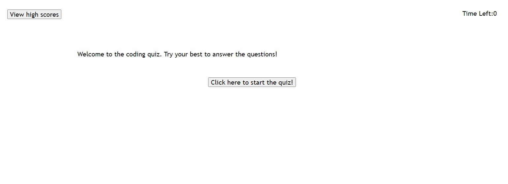
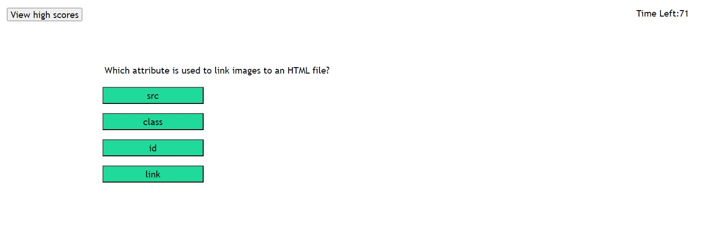
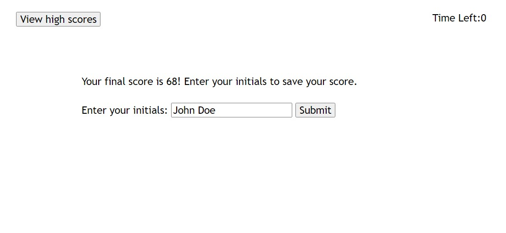
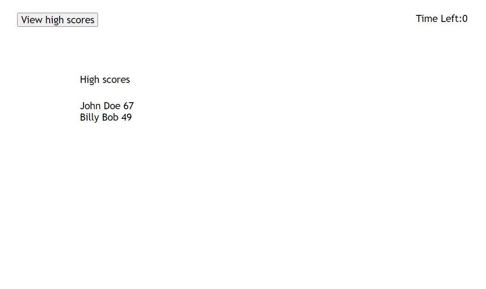

# <Your-Project-Title>

## Description

This is a timed coding quiz that is powered by JavaScript. It demonstrates how JavaScript logic can be used to create functionality on a website by linking different HTML elements together.

## Installation

This website requires no installation to use. Find it here: 
https://blee241.github.io/Timed-Coding-Quiz/.

## Usage

Start the quiz by clicking the button on the home page.

The timer will start to count down! Try to get as many questions correct as you can.

Enter your name at the end of the quiz to save your score.

Click the high scores button to see the saved scores and names.

## License

Copyright 2023 Bryant Lee

Permission is hereby granted, free of charge, to any person obtaining a copy of this software and associated documentation files (the “Software”), to deal in the Software without restriction, including without limitation the rights to use, copy, modify, merge, publish, distribute, sublicense, and/or sell copies of the Software, and to permit persons to whom the Software is furnished to do so, subject to the following conditions:

The above copyright notice and this permission notice shall be included in all copies or substantial portions of the Software.

THE SOFTWARE IS PROVIDED “AS IS”, WITHOUT WARRANTY OF ANY KIND, EXPRESS OR IMPLIED, INCLUDING BUT NOT LIMITED TO THE WARRANTIES OF MERCHANTABILITY, FITNESS FOR A PARTICULAR PURPOSE AND NONINFRINGEMENT. IN NO EVENT SHALL THE AUTHORS OR COPYRIGHT HOLDERS BE LIABLE FOR ANY CLAIM, DAMAGES OR OTHER LIABILITY, WHETHER IN AN ACTION OF CONTRACT, TORT OR OTHERWISE, ARISING FROM, OUT OF OR IN CONNECTION WITH THE SOFTWARE OR THE USE OR OTHER DEALINGS IN THE SOFTWARE.

